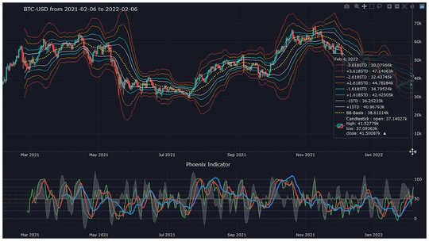
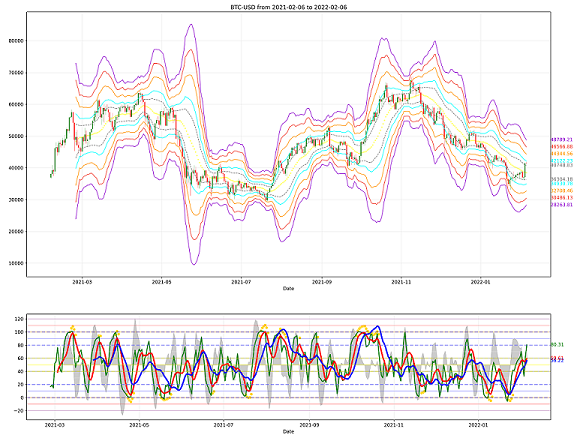

# PyPhoenix
The Python versions of the **Phoenix Ascending 2.201** and **Bad Ass B-Bands** indicators can be found in this repository. This code is written for personal use and analysis based on data analysis tools in Python. 

### Important Note:
* This code is **Open Source** and like the original code, is licensed under the [Mozilla Public License Version 2.0](LICENSE).
* **David Ward Jr  at wyckoffmode.com** wrote the two indicators used in this code in Pine Script, and all credit goes to him. 
* [Source of Phoenix Ascending 2.201](https://www.tradingview.com/script/ay9QX4dy-Phoenix-Ascending-2-201/)
* [Source of Bollinger Bands (Bad Ass B-Bands) - Wyckoff Mode](https://www.tradingview.com/script/QEpj11yZ-Bollinger-Bands-Bad-Ass-B-Bands-Wyckoff-Mode/)
* I'd like to thank David Ward Jr. for allowing me to use his indicators to build this code. 

## How to use:

### Prerequirements: 
Check that the packages listed in [requirements.txt](requirements.txt) are installed on your system or environment. 

### Usage:
1. First, clone the package in your system:

```bash
git clone https://github.com/siniorone/PyPhoenix.git
```
2. To use PyPhoenix go to the main repo directory, run the following command in your terminal to add ```src``` to your ```PYTHONPATH```:

```bash
cd PyPhoenix
export PYTHONPATH=${PWD}
```
3. The run the file ```run.py```:
```bash
python src/run.py
```

## Explore the code's functions:
* First of all we need to import the main class: 
```python
from src.phoenix import Phoenix
```
* Then we make an object from ```Phoenix```:
```python
btc = Phoenix("BTC-USD", "2021-02-06", "2022-02-06")
```
* Use the ```.graph()``` method to display an interactive graph:
```python
btc.graph()
```


* Use ```save=True``` to save the graph as a photo at the same time:
```python
btc.graph(save=True)
```
* If you want only the phoenix indicator to be displayed, you can use the following arguments:
```python
btc.graph(phoenix=True, chart=False)
```
* Method ```.graph2()``` allows you to use another visualization that makes use of Matplotlib and seaborn, and save the result as a high-quality image:
```python
btc.graph2(save=True)
```


* To get all the data of indicators and prices in the form of a ```pandas.DataFrame```, you can use method ```.to_dataframe()```:
```python
df = btc.to_dataframe()
df.shape
# Output: (366, 23)
```

```python
df.columns

# Output: Index(['open', 'high', 'low', 'close', 'hl2', 'hlc3', 'ohlc4', 'volume',
#      'green', 'red', 'blue', 'energy', 'basis', 'u1std', 'l1std', 'u16std',
#       'l16std', 'u26std', 'l26std', 'u36std', 'l36std', 'u46std', 'l46std'],
#     dtype='object')
```

```python
df.index

# DatetimeIndex(['2021-02-05', '2021-02-06', '2021-02-07', '2021-02-08',
#               '2021-02-09', '2021-02-10', '2021-02-11', '2021-02-12',
#               '2021-02-13', '2021-02-14',
#               ...
#               '2022-01-27', '2022-01-28', '2022-01-29', '2022-01-30',
#               '2022-01-31', '2022-02-01', '2022-02-02', '2022-02-03',
#               '2022-02-04', '2022-02-05'],
#              dtype='datetime64[ns]', name='Date', length=366, freq=None)
```
* You can modify the ```get_stock_data()``` function in the ```src/utils/dataminer.py``` file base on your need and according to your conditions, as long as the output of the function is a ```pandas.DataFrame``` with an index of ```Date``` and its columns ```Open, High, Low, Close, Adj Close, Volume```, the code will run correctly. 


| Index  | Open | High |	Low |	Close |	Adj Close |	Volume|
|---|---|---|---|---|---|---|
|Date | | | | | | 
|2021-02-05|36931.546|38225.906|36658.761|38144.308|38144.308|58598066|
|...|...|...|...|...|...|...|
